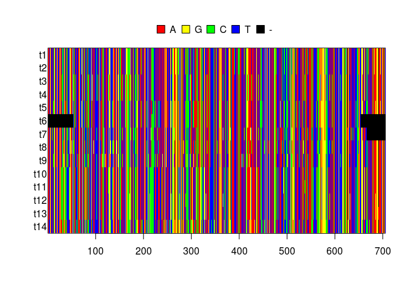
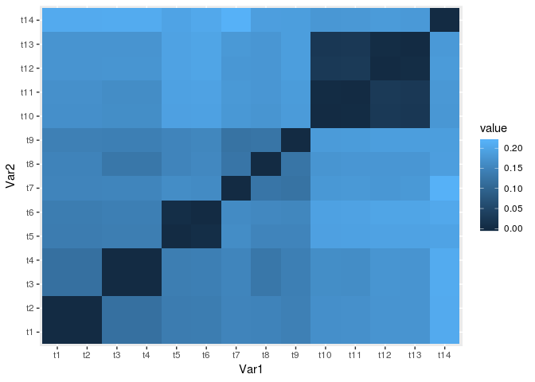
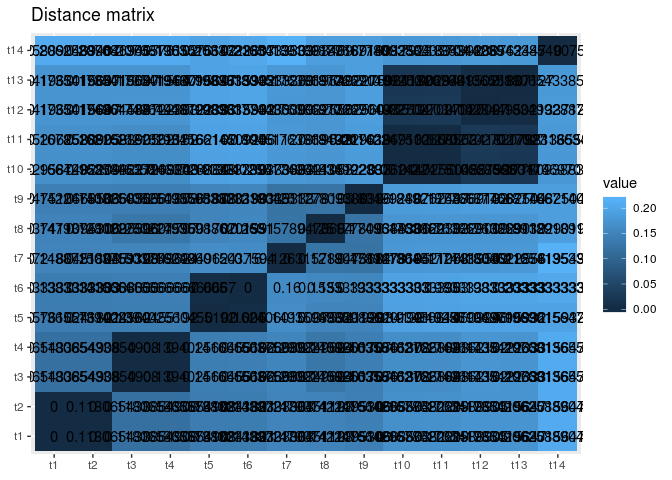
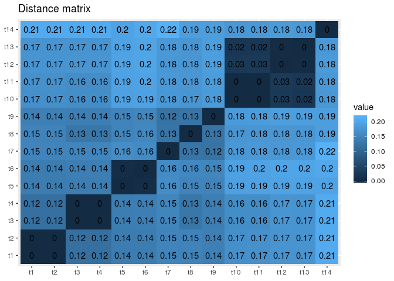
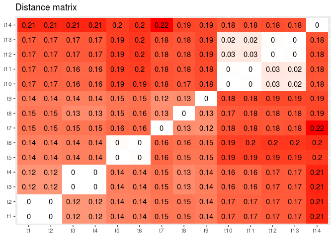

## R tutorial 1

### Tools needed

We would need the following:

+ package APE
+ package reshape2
+ package ggplot2
+ alignment in fasta format

I will assume that the alignment file is placed in the working directory.

### Distance matrix calculation and vizualization using ggplot2

Let's start with loading our fasta alignment in R using the package APE


```r
library (ape) #load the library
alignment <- read.dna("test.fas", format = "fasta") #load the file assuming it is in the working dir
alignment #print the info about the file
```

```
## 14 DNA sequences in binary format stored in a matrix.
## 
## All sequences of same length: 705 
## 
## Labels:
## t1
## t2
## t3
## t4
## t5
## t6
## ...
## 
## Base composition:
##     a     c     g     t 
## 0.349 0.166 0.144 0.340 
## (Total: 9.87 kb)
```

```r
image.DNAbin(alignment) #we can preview the alignment here
```



Now let's generate a distance matrix using `dist.dna` function. Model "raw" shows the proportion of different sites, and pairwise deletion means that sequences will be compared in pairs using all possible overlapping sites. For sequences that are not overlapping, empty value is returned. If the pairwise deletion is set to False (default), all sequences will be compared based on sites present in all taxa (e.g., from ~50bp to 650bp). With this setting even if a single pair of sequences does not overlap, the entire matrix will consist of NaN.
Finally, "as.matrix" option specifies the output format. While for some applications returning object of class `dist` is desired, this time I need data in a simple possible form for my ggplot table.


```r
dist_matrix <- dist.dna(alignment, model="raw", pairwise.deletion = T, as.matrix = T)
dist_matrix
```

```
##            t1        t2        t3        t4        t5        t6        t7
## t1  0.0000000 0.0000000 0.1180654 0.1180654 0.1365576 0.1383333 0.1488722
## t2  0.0000000 0.0000000 0.1180654 0.1180654 0.1365576 0.1383333 0.1488722
## t3  0.1180654 0.1180654 0.0000000 0.0000000 0.1394026 0.1416667 0.1503759
## t4  0.1180654 0.1180654 0.0000000 0.0000000 0.1394026 0.1416667 0.1503759
## t5  0.1365576 0.1365576 0.1394026 0.1394026 0.0000000 0.0050000 0.1624060
## t6  0.1383333 0.1383333 0.1416667 0.1416667 0.0050000 0.0000000 0.1600000
## t7  0.1488722 0.1488722 0.1503759 0.1503759 0.1624060 0.1600000 0.0000000
## t8  0.1479374 0.1479374 0.1280228 0.1280228 0.1493599 0.1550000 0.1263158
## t9  0.1422475 0.1422475 0.1408250 0.1408250 0.1493599 0.1533333 0.1218045
## t10 0.1664296 0.1664296 0.1635846 0.1635846 0.1920341 0.1933333 0.1789474
## t11 0.1678521 0.1678521 0.1621622 0.1621622 0.1934566 0.1950000 0.1804511
## t12 0.1735420 0.1735420 0.1749644 0.1749644 0.1948791 0.1983333 0.1774436
## t13 0.1735420 0.1735420 0.1735420 0.1735420 0.1948791 0.1983333 0.1804511
## t14 0.2062589 0.2062589 0.2076814 0.2076814 0.1963016 0.2033333 0.2165414
##            t8        t9         t10         t11        t12        t13
## t1  0.1479374 0.1422475 0.166429587 0.167852063 0.17354196 0.17354196
## t2  0.1479374 0.1422475 0.166429587 0.167852063 0.17354196 0.17354196
## t3  0.1280228 0.1408250 0.163584637 0.162162162 0.17496444 0.17354196
## t4  0.1280228 0.1408250 0.163584637 0.162162162 0.17496444 0.17354196
## t5  0.1493599 0.1493599 0.192034139 0.193456615 0.19487909 0.19487909
## t6  0.1550000 0.1533333 0.193333333 0.195000000 0.19833333 0.19833333
## t7  0.1263158 0.1218045 0.178947368 0.180451128 0.17744361 0.18045113
## t8  0.0000000 0.1251778 0.174964438 0.176386913 0.17638691 0.17638691
## t9  0.1251778 0.0000000 0.183499289 0.184921764 0.18776671 0.18776671
## t10 0.1749644 0.1834993 0.000000000 0.001422475 0.02560455 0.02275960
## t11 0.1763869 0.1849218 0.001422475 0.000000000 0.02702703 0.02418208
## t12 0.1763869 0.1877667 0.025604552 0.027027027 0.00000000 0.00284495
## t13 0.1763869 0.1877667 0.022759602 0.024182077 0.00284495 0.00000000
## t14 0.1891892 0.1877667 0.177809388 0.179231863 0.18349929 0.18065434
##           t14
## t1  0.2062589
## t2  0.2062589
## t3  0.2076814
## t4  0.2076814
## t5  0.1963016
## t6  0.2033333
## t7  0.2165414
## t8  0.1891892
## t9  0.1877667
## t10 0.1778094
## t11 0.1792319
## t12 0.1834993
## t13 0.1806543
## t14 0.0000000
```

If you wish to save the matrix to file, supplying the `dist_matrix` variable to the function `write.csv` would be the easiest option to use.
Now let's vizualize this matrix as a table with cells colored according to the value. I will use "ggplot2" library for this, but first I need to modify my data a bit. For this plot, data needs to be in a "long format", i.e. instead of a matrix it needs to be converted to records like 'taxon1 taxon2 value' and put into a data frame. We can then plot it showing for example taxon1 on X axis, taxon2 on Y axis, and value as a table cell. You can change the data format manually, but perhaps the most simple way is to use the `reshape2` package.


```r
library(reshape2)
melted <- melt(dist_matrix) #reformat matrix the long way
melted[1:10,] #just print first 10 columns to check
```

```
##    Var1 Var2     value
## 1    t1   t1 0.0000000
## 2    t2   t1 0.0000000
## 3    t3   t1 0.1180654
## 4    t4   t1 0.1180654
## 5    t5   t1 0.1365576
## 6    t6   t1 0.1383333
## 7    t7   t1 0.1488722
## 8    t8   t1 0.1479374
## 9    t9   t1 0.1422475
## 10  t10   t1 0.1664296
```

The most simple command to visualize this data as a heat map is as follows. The `melt` function from above has generated a dataframe with columns `Var1`, `Var2` and `value`. Thus we can supply the names of these variables to ggplot. I like to add ggplot geoms through "+", this way it is more clear to me what is going on:


```r
library(ggplot2)
ggplot(melted, aes(x=Var1, y=Var2, fill=value)) + 
  geom_tile() #heat mape style
```



Here is a one-liner for the same graph. However, I do like the long form as I typically do a lot of customization anyway.


```r
qplot(data=melted, x=Var1, y=Var2, fill=value, geom="tile")
```


So let's go back to the first code option and enhance it. In particular, I am adding `geom_text` to place the values in the cells, removing "Var1" and "Var2" labels, and add the title to the plot.


```r
ggplot(melted, aes(x=Var1, y=Var2, fill=value)) + 
  geom_tile() + #heat mape style
  geom_text(aes(label = value))+ #print values in cells
  labs(x = NULL, y = NULL, title = "Distance matrix") #adjust legends
```



As you can see, there is way too many significant figures in the values. One way to fix this is to round the matrix prior to "melting" and visualization, something like `round(dist_matrix,2)`. However, if you don't want to alter the original matrix, you can fix it in the plot


```r
ggplot(melted, aes(x=Var1, y=Var2, fill=value)) + 
  geom_tile() + #heat mape style
  geom_text(aes(label = round(value, digits = 2)))+ #print rounded values in cells
  labs(x = NULL, y = NULL, title = "Distance matrix") #adjust legends
```



Finally, if you would want to change colors, you can do so by changing ggplot scale. We have continuous data and using geom_tile with `fill`, so our options include specifying different gradients using `scale_fill_continuous` or adjusting gradients using `scale_fill_gradient`. Below is a color scheme resembling SequenceMatrix colors. You can switch off the legend by either telling `geom_tile` not to produce one (first code example), or to turn it off completely (second code example):


```r
#switch the legend off on the geom level
ggplot(melted, aes(x=Var1, y=Var2, fill=value)) + 
  geom_tile(show.legend=F) + #heat mape style, legend turned off
  geom_text(aes(label = round(value, digits = 2)))+ #print rounded values in cells
  labs(x = NULL, y = NULL, title = "Distance matrix")+ #adjust legends
  scale_fill_gradient(low = "white", high = "red")
```



```r
# #switch the legend off entirely
# ggplot(melted, aes(x=Var1, y=Var2, fill=value)) + 
#   geom_tile(show.legend=T) + #heat mape style
#   geom_text(aes(label = round(value, digits = 2)))+ #print rounded values in cells
#   labs(x = NULL, y = NULL, title = "Distance matrix")+ #adjust legends
#   scale_fill_gradient(low = "white", high = "red") +
#   theme(legend.position="none")
```

When adding or removing layers it is important to keep track of `+`. Especially if you have comments at the end of lines.
To save this graph we can either open a say pdf device, perform plotting, and shut it off, or alternatively use `ggsave` function that can save ggplot creations.


```r
#save last plot to pdf
ggsave("test.pdf")
```

```
## Saving 7 x 5 in image
```

*Last edited on 25 February, 2019*
