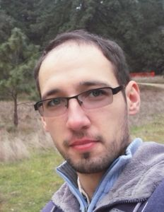

# Welcome

Hi! My name is Alex. I am a Postdoctoral Research Fellow in the Schwartz lab at the University of Rhode Island, currently working on examination of phylogenomic datasets using a variety of computational tools, including machine learning. Feel free to visit [Dr. Schwartz's lab website](https://schwartzlaburi.github.io/) to learn more.

One of my research interests is a high-throughput data processing, particularly dealing with the DNA sequencing data. This web site will reference some of the bioinformatic tools I use in my research. [This repository](https://github.com/AlexKnyshov/main_repo) is my main storage of (mostly) utility scripts, primarily written in Python and R. Specific bioinformatic tools and projects have their own repositories and can be found [here](https://github.com/AlexKnyshov).

I am also interested in helping others to process data in phylogenetic context and organized a series of workshops on phylogenetic and bioinformatic methods for my labmates. Transfer of the prepared materials to this website is WIP, but some of the tutorials can already be found in [Python]({{ site.url }}/Py_pages.html) and [R]({{ site.url }}/R_pages.html) sections.

Further details can be found in my [CV]({{ site.url }}/KnyshovCV.pdf). 